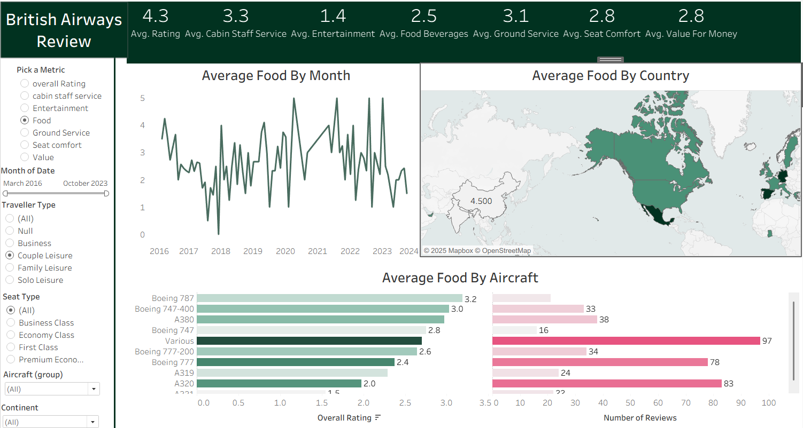
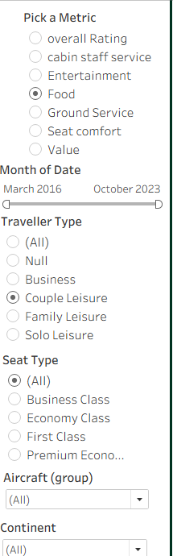

# ✈️ British Airways Review Analysis (2016–2023)

## 📌 Project Overview
This Tableau project analyzes **British Airways customer reviews** from March 2016 to October 2023.  
The dashboard provides insights into **traveller satisfaction** across multiple dimensions including:  
- Food & Beverages  
- Cabin Staff Service  
- Entertainment  
- Ground Service  
- Seat Comfort  
- Value for Money  

👉 [View the Dashboard on Tableau Public](https://public.tableau.com/app/profile/srilekhya.vemulawada/viz/British_Airways_Review_17587167774490/Dashboard1?publish=yes)

---

## 📊 Dataset
- **Source:** (Replace with Kaggle / Web-scraped / Provided dataset)  
- **Rows:** ~446  
- **Key Fields:**  
  - Date of Review  
  - Traveller Type (Business, Family, Solo, Couple)  
  - Seat Type (Business Class, Economy, Premium, First Class)  
  - Aircraft Model (Boeing 787, A380, etc.)  
  - Ratings (Overall, Food, Cabin Staff, Entertainment, etc.)  

---

## 🎯 Business Questions
1. How have food ratings changed over time?  
2. Which traveller type gives the highest ratings?  
3. How do different seat classes compare?  
4. Which aircraft models are rated best?  
5. Which countries show the highest/lowest satisfaction?  

---

## 📈 Dashboard Features
✅ KPI Cards – Average ratings for food, staff, entertainment, etc.  
✅ Trend Analysis – Average food rating by month (2016–2023).  
✅ Geographic View – Average food ratings by country.  
✅ Aircraft Comparison – Ratings & review counts by aircraft type.  
✅ Filters – Traveller type, seat type, aircraft, and date.  

---

## 🔑 Key Insights
- Food ratings average around **2.5–3.0**, showing room for improvement.  
- **Business Class travellers** rate higher compared to Economy passengers.  
- **Boeing 787** shows stronger satisfaction scores compared to other aircraft.  
- **North America & Europe** have higher satisfaction compared to Asia.  

---

## 🛠️ Tools & Skills Used
- Tableau Public – Dashboard creation, KPI cards, map visualization.  
- Excel / SQL / Python – Data cleaning & preparation (replace with what you used).  
- Data Analysis – Trend analysis, comparative insights.  

---

## 📸 Dashboard Preview
  
  

---

## 🚀 How to Reproduce
1. 1. Use the dataset files included in this repository: [`ba_reviews.csv`](ba_reviews.csv) and [`Countries.csv`](Countries.csv).  
2. Open Tableau Public / Tableau Desktop.  
3. Import the dataset and connect.  
4. Use the dashboard file (`dashboard.twbx`) included in this repo.  

---

## 📝 Author
👩‍💻 **Srilekhya Vemulawada**  
- 💼  Data Analyst  
- 🌐 [LinkedIn](https://www.linkedin.com/in/srilekhya-vemulawada/) 

